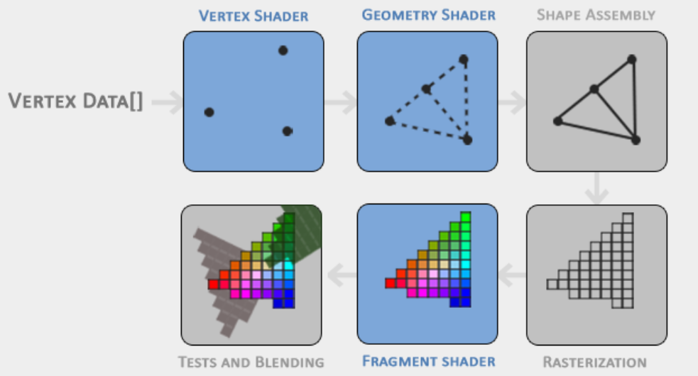

# Graphic Pipeline
The graphics pipeline can be divided into two large parts: the first transforms your 3D coordinates into 2D coordinates and the second part transforms the 2D coordinates into actual colored pixels.

The graphics pipeline can be divided into several steps where each step requires the output of the previous step as its input. All of these steps are highly specialized (they have one specific function) and can easily be executed in parallel.

Each GPU has thousand of small cores. The processing cores run small programs on the GPU for each step of the pipeline. These small programs are called shaders. 

Some of these shaders are configurable by the developer which allows us to write our own shaders to replace the existing default shaders. Shaders are written in the OpenGL Shading Language (GLSL).

As input to the graphics pipeline we pass in a list of three 3D coordinates that should form a triangle in an array here called Vertex Data; this vertex data is a collection of vertices. A vertex is a collection of data per 3D coordinate. This vertex's data is represented using vertex attributes that can contain any data we'd like, but for simplicity's sake let's assume that each vertex consists of just a 3D position and some color value.

The first part of the pipeline is the vertex shader that takes as input a single vertex. The main purpose of the vertex shader is to transform 3D coordinates into different 3D coordinates (more on that later) and the vertex shader allows us to do some basic processing on the vertex attributes.

The output of the vertex shader stage is optionally passed to the geometry shader. The geometry shader takes as input a collection of vertices that form a primitive and has the ability to generate other shapes by emitting new vertices to form new (or other) primitive(s). In this example case, it generates a second triangle out of the given shape.

The primitive assembly stage takes as input all the vertices (or vertex if GL_POINTS is chosen) from the vertex (or geometry) shader that form one or more primitives and assembles all the point(s) in the primitive shape given; in this case two triangles.

The output of the primitive assembly stage is then passed on to the rasterization stage where it maps the resulting primitive(s) to the corresponding pixels on the final screen, resulting in fragments for the fragment shader to use. Before the fragment shaders run, clipping is performed. Clipping discards all fragments that are outside your view, increasing performance. 

[A fragment in OpenGL is all the data required for OpenGL to render a single pixel.]

The main purpose of the fragment shader is to calculate the final color of a pixel and this is usually the stage where all the advanced OpenGL effects occur. Usually the fragment shader contains data about the 3D scene that it can use to calculate the final pixel color (like lights, shadows, color of the light and so on). 

After all the corresponding color values have been determined, the final object will then pass through one more stage that we call the alpha test and blending stage. This stage checks the corresponding depth (and stencil) value (we'll get to those later) of the fragment and uses those to check if the resulting fragment is in front or behind other objects and should be discarded accordingly. The stage also checks for alpha values (alpha values define the opacity of an object) and blends the objects accordingly. So even if a pixel output color is calculated in the fragment shader, the final pixel color could still be something entirely different when rendering multiple triangles. 

In modern OpenGL we are required to define at least a vertex and fragment shader of our own (there are no default vertex/fragment shaders on the GPU).